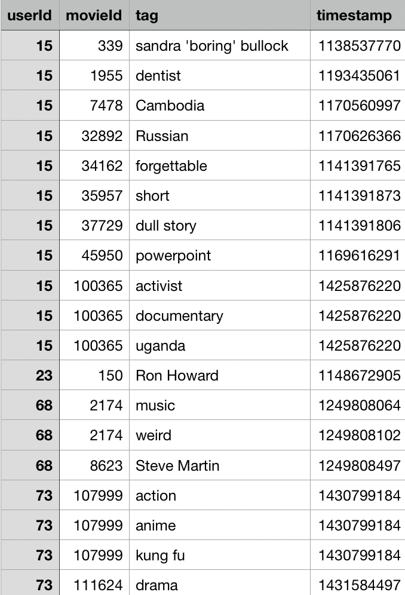

#分区表实战

## 静态分区

### 应用场景1
>每天都有很多用户给电影打标签的记录，当天的数据当天加载。  
**日期**是确定的

#### 数据示例


- 第一步，创建hive表并导入数据

```sql
use hive;

create external table if not exists tag_1(
        userId string comment '用户ID',
        movieId string comment '电影ID',
        tag string comment '标签',
        timestamp int comment '时间戳'
)
row format delimited fields terminated by ',';
```

```sql
use hive;

load data local inpath '/Users/liufukang/Project/hive/data/' overwrite into table tag_1;
```

- 第二步，创建分区表并导入相应日期的数据

```sql
use hive;

create external table if not exists tag_2(
        userId string,
        movieId string,
        tag string,
        timestamp int
)
partitioned by (dt string)
row format delimited fields terminated by ',';

insert into tag_2 partition (dt='2015-12-10')
select userId, movieId, tag, timestamp from tag_1 where from_unixtime(timestamp,'yyyy-MM-dd')='2015-12-10';
```

## 动态分区

### 应用场景1
>每天都有很多用户给电影打标签的记录，当天的数据当天加载。  
>**日期**是非确定的  

**`动态分区表的插入原则，分区字段的取值字段放在select字句的最后面,顺序需和建表的分区顺序一致，实际的分区顺序还是依据建表时的顺序`**

- 第一步，创建hive表并导入数据

```sql
use hive;

create external table if not exists tag_1(
        userId string comment '用户ID',
        movieId string comment '电影ID',
        tag string comment '标签',
        timestamp int comment '时间戳'
)
row format delimited fields terminated by ',';
```
- 第二步，创建分区表并导入相应日期的数据

**`hive.exec.max.dynamic.partitions.pernode(每个MR节点最大创建动态分区数)`**  
**`hive.exec.max.dynamic.partitions(所有MR节点一共可以创建最大动态分区数)`**  
**`hive.exec.max.created.files(整个MR job,最大可以创建HDFS文件数)`**  
```sql
use hive;

set hive.exec.dynamic.partition=true;
set hive.exec.dynamic.partition.mode=nostrict;
set hive.exec.max.dynamic.partitions.pernode=2000;

create external table if not exists tag_3(
        userId string,
        movieId string,
        tag string,
        timestamp int
)
partitioned by (dt string)
row format delimited fields terminated by ',';

insert into tag_3 partition (dt)
select *,from_unixtime(timestamp,'yyyy-MM-dd')from tag_1;
```

**`tips:`** 当分区字段包含动态分区和静态分区两种字段时，动态分区字段不能作为静态分区字段的父级

## 修改分区
```sql
use hive;

create table tag_4 like tag_3;
```

### 添加分区
**`结果：`** 新建一个空目录
```
alter table tag_4 add partition(dt='2019-06-20');
```
**`结果：`** 修改分区字段目录名称 
### 修改分区

```
alter table tag_4 partition(dt='2019-06-20') rename to partition(dt='2018-06-20');
```

### 交换分区
**`结果：`** tag_3的指定分区移动到tag_4
```
alter table tag_4 exchange partition (dt='2016-10-17') with table tag_3;
```

### 恢复分区
**`结果：`** 更新元数据表
```
!hadoop fs -mkdir /user/hive/warehouse/hive.db/tag_4/dt=019-05-20;

msck repair table tag_4;
```

### 删除分区
**`结果：`** 删除指定分区
```
alter table tag_4 drop partition(dt='2019-05-20');
```