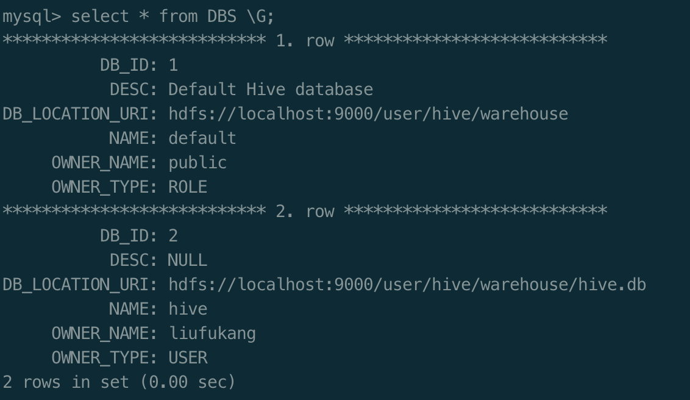
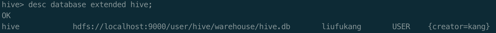
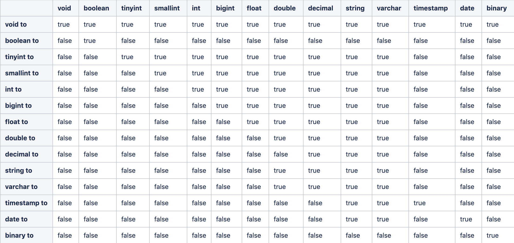

# Hive

## Hive简介

>The Apache Hive ™ data warehouse software facilitates reading, writing, and managing large datasets residing in distributed storage using SQL. Structure can be projected onto data already in storage. A command line tool and JDBC driver are provided to connect users to Hive.

- Hive是建立在Hadoop HDFS上的数据仓库基础架构
- Hive可以用来进行数据提取转换加载（ETL）,通过sqoop加载数据
- Hive定义的简单的sql查询语言Hql
- Hive是sql解析引擎，将sql语句转换为M/R job或spark job执行
- Hive的表其实就是HDFS文件和目录

### Hive元数据
- Hive将元数据存储在数据库中，支持mysql、derby等数据库
- Hive中的元数据包括表的名字，表的列和分区及其属性（是否为外部表），表的数据所在的目录等
### 模式
- 单用户模式（使用默认的derby数据库，同一时间只能有一个用户使用，需配置缓存目录）
- 多用户模式 (使用mysql作为元数据数据库，需上传连接的jar，初始化数据库)
- 远程模式 （需启动metastore server --> `hive --service metastore`）

### Hive应用场景
- 交互式查询分析
- 大数据平台ETL工具
- 基于Hadoop的数据仓库

## Hive安装和部署

- 安装包下载：`curl -O http://archive.cloudera.com/cdh5/cdh/5/hive-1.1.0-cdh5.7.0.tar.gz`
- 解压并配置环境变量
- 修改配置文件  
**`hive.env.sh`**  

|name    | description  |  
|--------|------|
|HADOOP_HOME   | 指定Hadoop安装路径 |
|HIVE_CONF_DIR  |指定hive配置文件路径|

**`hive-site.xml`** 

|name    | value   | 
|-------|----------|
|avax.jdo.option.ConnectionURL|jdbc:mysql://localhost:3306/hive?createDatabaseIfNotExist=true\&amp;useSSL=false|
|javax.jdo.option.ConnectionDriverName|com.mysql.jdbc.Driver|
|javax.jdo.option.ConnectionUserName|root|
|javax.jdo.option.ConnectionPassword<|123456|  

web界面配置参考：https://cwiki.apache.org/confluence/display/Hive/HiveWebInterface#HiveWebInterface-FeaturesofHWI

- 官网下载mysql和mysql连接类  
启动如有mysql报错，可以尝试初始化：`schematool -dbType mysql -initSchema`

## Hive CLI(客户端操作)

### Hive DDL（数据定义语言）之数据库操作

官网地址：https://cwiki.apache.org/confluence/display/Hive/LanguageManual+DDL

#### Create/Drop/Alter/Use Database

- Create Database
> CREATE (DATABASE|SCHEMA) [IF NOT EXISTS] database_name  
  [COMMENT database_comment]  
  [LOCATION hdfs_path]  
  [WITH DBPROPERTIES (property_name=property_value, ...)];  

  查看数据库信息
    
  
  命令行添加当前数据库提示  
  `set hive.cli.print.current.db=true;`

- Drop Database
> DROP (DATABASE|SCHEMA) [IF EXISTS] database_name [RESTRICT|CASCADE];

- Alter Database
> ALTER (DATABASE|SCHEMA) database_name SET DBPROPERTIES (property_name=property_value, ...);   -- (Note: SCHEMA added in Hive 0.14.0)
 
> ALTER (DATABASE|SCHEMA) database_name SET OWNER [USER|ROLE] user_or_role;   -- (Note: Hive 0.13.0 and later; SCHEMA added in Hive 0.14.0)
  
> ALTER (DATABASE|SCHEMA) database_name SET LOCATION hdfs_path; -- (Note: Hive 2.2.1, 2.4.0 and later)

- Use Database

#### Create/Drop/Truncate Table

- [Create Table](https://cwiki.apache.org/confluence/display/Hive/LanguageManual+DDL#LanguageManualDDL-CreateTable)

示例
```
hive (hive)> create table emp(
           > empno int,
           > ename string,
           > job string,
           > mgr int,
           > hiredate string,
           > sal double,
           > deptno int
           > ) ROW FORMAT DELIMITED FIELDS TERMINATED BY '\t';
```

查看表结构信息  
`desc formatted emp;`

- Drop Table
> DROP TABLE [IF EXISTS] table_name [PURGE];  
> 如果不指定purge，数据会被移动到.Transh/Current目录下

- Truncate Table
> TRUNCATE TABLE table_name [PARTITION partition_spec];    
partition_spec:  
    : (partition_column = partition_col_value, partition_column = partition_col_value...)

#### Alter Table/Partition/Column
- [Alter Table](https://cwiki.apache.org/confluence/display/Hive/LanguageManual+DDL#LanguageManualDDL-AlterTable)

- [Alter Partition](https://cwiki.apache.org/confluence/display/Hive/LanguageManual+DDL#LanguageManualDDL-AlterPartition)

- [Alter Column](https://cwiki.apache.org/confluence/display/Hive/LanguageManual+DDL#LanguageManualDDL-AlterColumn)

- [Alter Either Table or Partition](https://cwiki.apache.org/confluence/display/Hive/LanguageManual+DDL#LanguageManualDDL-AlterEitherTableorPartition)

### Hive DML（数据操作语言）

#### Loading files into tables

>LOAD DATA [LOCAL] INPATH 'filepath' [OVERWRITE] INTO TABLE tablename [PARTITION (partcol1=val1, partcol2=val2 ...)]
 
>LOAD DATA [LOCAL] INPATH 'filepath' [OVERWRITE] INTO TABLE tablename [PARTITION (partcol1=val1, partcol2=val2 ...)] [INPUTFORMAT 'inputformat' SERDE 'serde'] (3.0 or later)
```bash
# /user/hive/warehouse/hive.db/emp/emp.txt
hive (hive)> LOAD DATA LOCAL INPATH '/Users/liufukang/app/hive-1.1.0-cdh5.7.0/test_data/emp.txt' OVERWRITE INTO TABLE emp;
```

#### [Inserting data into Hive Tables from queries](https://cwiki.apache.org/confluence/display/Hive/LanguageManual+DML#LanguageManualDML-InsertingdataintoHiveTablesfromqueries)
```sql
INSERT INTO TABLE emp1 SELECT * FROM emp;
```

#### [Writing data into the filesystem from queries](https://cwiki.apache.org/confluence/display/Hive/LanguageManual+DML#LanguageManualDML-Writingdataintothefilesystemfromqueries)
```SQL
hive (hive)> INSERT OVERWRITE LOCAL DIRECTORY '/Users/liufukang/app/hive-1.1.0-cdh5.7.0/test_data/' ROW FORMAT DELIMITED FIELDS TERMINATED BY ','
           > SELECT * FROM emp1;
```

### [LanguageManual Select](https://cwiki.apache.org/confluence/display/Hive/LanguageManual+Select)

### [实践](https://github.com/kangapp/Hive/tree/master/CLI)

## Beeline
> HiveServer2的CLI，一个JDBC客户端

|hive-site.xml||
|---|---|
|name | description|
|Hive.server2.thrift.min.worker.threads|最小工作线程数，默认5（最大500）
|Hive.server2.thrift.port|TCP的监听端口，默认10000|
|Hive.server2.thrift.bind.host|TCP绑定的主机，默认localhost|
|Hive.server2.thrift.transport.mode|默认TCP,可选HTTP|
|Hive.server2.thrift.http.port|HTTP的监听端口，默认值为10001|

### 嵌入式模式
> 返回一个嵌入式的Hive，类似Hive CLI

### 远程模式
> 通过Thrift协议与某个单独的Hive Server2进程进行连接通信

先启动hiveserver2  
再启动beeline

```bash
>beeline !connect jdbc:hive2://localhost:10000/hive  
#输入用户名和密码

1: jdbc:hive2://localhost:10000/hive>
```


## Hive数据类型

### 数字类型
|Type | description |
|---| ---|
|TINYINT|1-byte signed integer, from -128 to 127|
|SMALLINT|2-byte signed integer, from -32,768 to 32,767|
|INT/INTEGER|4-byte signed integer, from -2,147,483,648 to 2,147,483,647|
|BIGINT|8-byte signed integer, from -9,223,372,036,854,775,808 to 9,223,372,036,854,775,807|
|FLOAT|1-byte signed integer, from -128 to 127|
|DOUBLE|1-byte signed integer, from -128 to 127|

### 时间/日期类型
|Type | description |
|---| ---|
|TIMESTAMP |[详情](https://cwiki.apache.org/confluence/display/Hive/LanguageManual+Types#LanguageManualTypes-timestamp)|
|DATE|0000-­01-­01 to 9999-­12-­31|

### 字符
|Type | description |
|---| ---|
|STRING|用单引号或双引号引起来的字符串|
|VARCHAR|字符数介于1-65535，超过的会被截断；不能直接使用UDF,用GenericUDF代替或先转换成STRING|
|CHAR|固定长度，最大长度255，char(10)|

### Misc
|Type | description |
|---| ---|
|BOOLEAN|布尔类型|
|BINARY|二进制类型|

### 复杂数据类型
|Type | description |
|---| ---|
|ARRAY<TYPE>|数组|
|MAP<primitive_type, data_type>|映射|
|STRUCT<col_name : data_type [COMMENT col_comment], ...>|结构体|
|UNIONTYPE<data_type, data_type, ...> |联合体|

#### [复杂数据类型实战](https://github.com/kangapp/Hive/tree/master/ComplexType)

### 数据类型的隐式转换


### 数据类型的显示转换方法
> CAST (VALUE AS TYPE)

```SQL
SELECT name,salary FROM employee
WHERE cast(salary as float) < 100.0

#时间戳相关转换
cast（date as date）
cast（timestamp as date）
cast（string as date）
cast（date as timestamp）
cast（date as string）
```
## Hive表

### 分区表
> 分区表指的是创建表时，指定parrtition的分区空间，每一个分区值都会形成一个具体的分区目录，分区字段是**伪字段**，不能与表定义字段重名。

#### 分区语法
```sql
partitioned by (par_col pa_type)
```

#### 静态分区和动态分区
```bash
#开启动态分区功能
set hive.exec.dynamic.partition=true;
#允许所有的分区字段都可以使用动态分区，默认strict
set hive.exec.dynamic.partition.mode=nostrict;
```

#### [分区表实战](https://github.com/kangapp/Hive/tree/master/PARTITION)

### 分桶表

```BASH
#开启分桶功能
set hive.enforce.bucketing = true
```

#### 分桶语法
```sql
CLUSTERED BY(userid) SORTED BY(time) INTO 32 BUCKETS
```

### 倾斜表
> 倾斜表只是通过将倾斜特别严重的列分开存储为不同的文件，每个倾斜值指定为一个目录或一个文件，因此在查询的时候，可以通过过滤倾斜数据来避免数据倾斜的问题

#### 语法
```sql
SKEWED BY(userid) on(null) [STORED AS DIRECTORIES]
```

### 临时表

> 只能在当前会话中可见的表称为临时表  
如果创建临时表时，创建了一个与已存在表名相同的临时表，则在当前会话中，所有对该表的使用都是指向临时表  
不支持分区字段  
不支持建索引

## Hive执行计划

## UDF函数
内置UDF函数：https://cwiki.apache.org/confluence/display/Hive/LanguageManual+UDF
### UDF
> 一对一
```sql
select length(name) from emp1;
```
### UDAF
> 多对一
```sql
select sum(salary) from emp1;
```
### UDTF
> 一对多
```sql
--- map or array
select explode(deductions) from emp1;
```
## [实战](https://github.com/kangapp/Hive/tree/master/UDF)